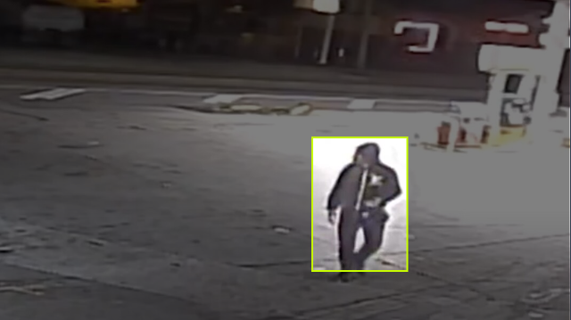

# Sistema de seguridad automático

## Descripción del problema

Una empresa que se dedica a rentar bodegas como las que aparecen en las [imágenes](#imágenes-de-bodegas) quiere mejorar la eficiencia de su sistema de seguridad. 

Dicho sistema de seguridad consiste en tener dos guardias de seguridad encargados de revisar la entrada y salida de personas, vigilar la transimisión de video de las cámaras de seguridad instaladas en todo el establecimiento y ejecutar protocolos de seguridad cuando detecten personas no autorizadas o personas ejecutando acciones sospechosas dentro del establecimiento.

La empresa quiere lograr mejorar la eficiencia de su sistema de seguridad sin eliminar completamente la corroboración humana de los eventos o sucesos, y al mismo tiempo quiere reducir la probabilidad de que su personal facilite las condiciones para que suceda algún evento.

### Imágenes de bodegas

| Interiores | Exteriores |
| --- | --- |
|  |  |
|  |  |
|  |   |

## Análisis del problema

Dada la descripción general del problema, se pueden definir dos puntos clave para el diseño de la solución al problema:

1. Se quiere mejorar la capacidad de los guardias para detectar eventos a través de la transmisión de video de las cámaras de seguridad
2. Se quiere encontrar una forma de registrar eventos e información importante de estos cuando los guardias no los reporten y no ejecuten los protocolos de seguridad

## Propuesta de solución

Una opción para abordar el problema es integrar al sistema de vigilancia un [modelo de detección de objetos](link-a-recurso-adicional) entrenado para detectar **personas** de todo tipo en diferentes **ángulos de cámara** en [imágenes](#imágenes-de-cámaras-de-seguridad) de **resolución media o baja** (resolución de cámaras de vigilancia) con vista **diurna y nocturna**. 

La idea sería que la transmisión de video que vigilan los guardias de seguridad también incluya los [recuadros generados](#imágenes-con-recuadros) por el modelo de detección, así facilitando el trabajo de detectar oportunamete eventos o sucesos. También, la idea seria que los eventos o sucesos **potenciales** que el modelo de detecte se **registraran** con la información pertinente, como las horas de inicio y fin del suceso y el fragmento de video correspondiente, así facilitándole la **investigación de sucesos sospechosos** a la administración y **disuadiendo** a los guardias de facilitar las condiciones para que suceda un evento.

### Imágenes de cámaras de seguridad

| Diurnas | Nocturnas |
| ------- | --------- |
|  |  |

### Imágenes con recuadros

| Interiores | Exteriores |
| ---------- | ---------- |
|  |  |

## Implementación de la solución

## Referencias

[Datos](https://universe.roboflow.com/dongguk-university-v2wxu/camera-calibration/browse?queryText=&pageSize=50&startingIndex=0&browseQuery=true)
