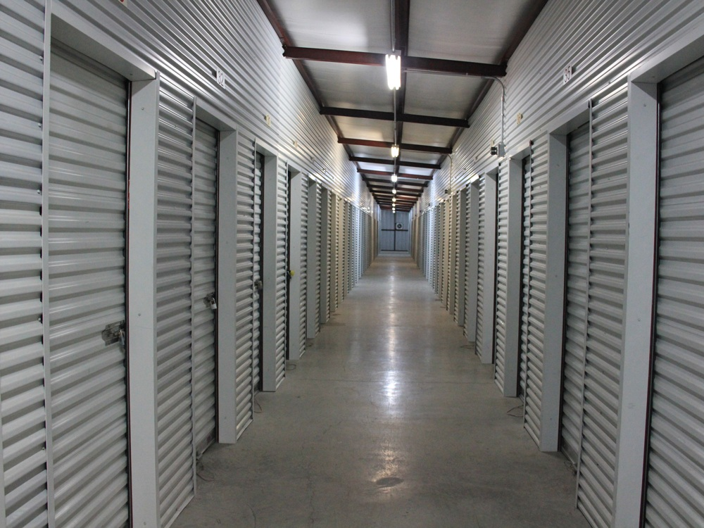
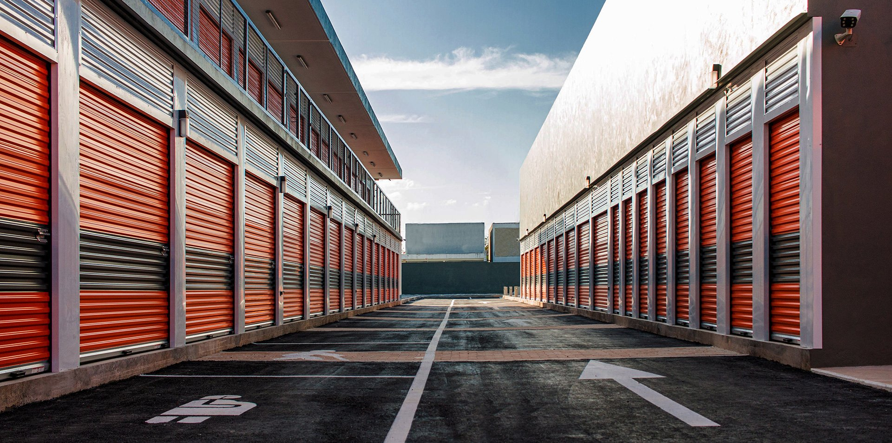
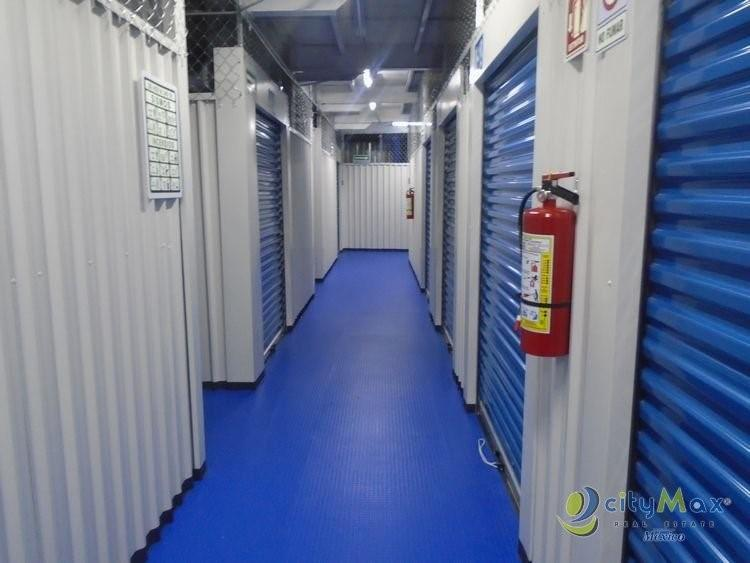
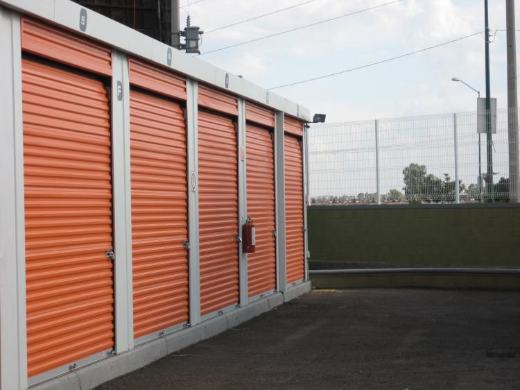
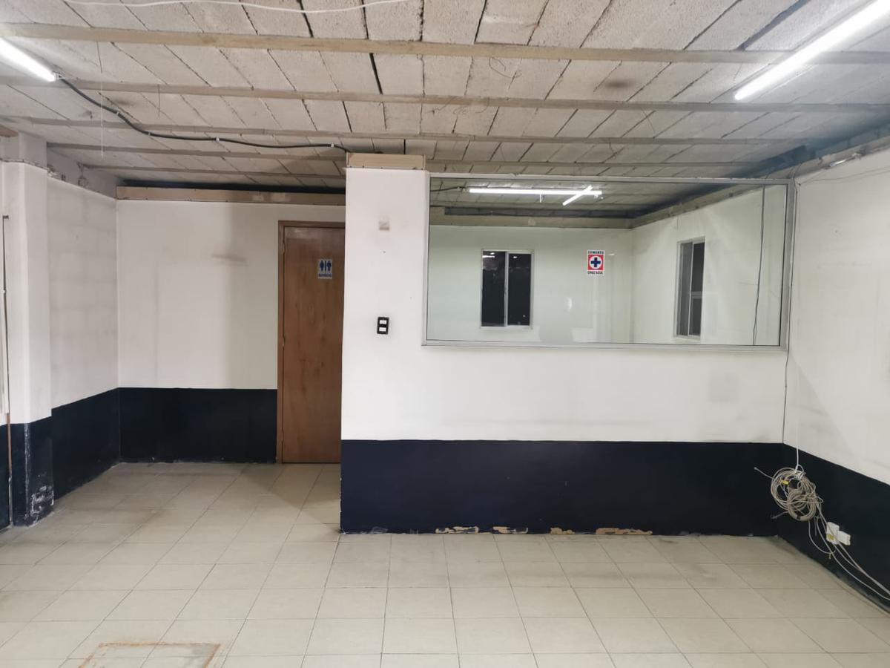
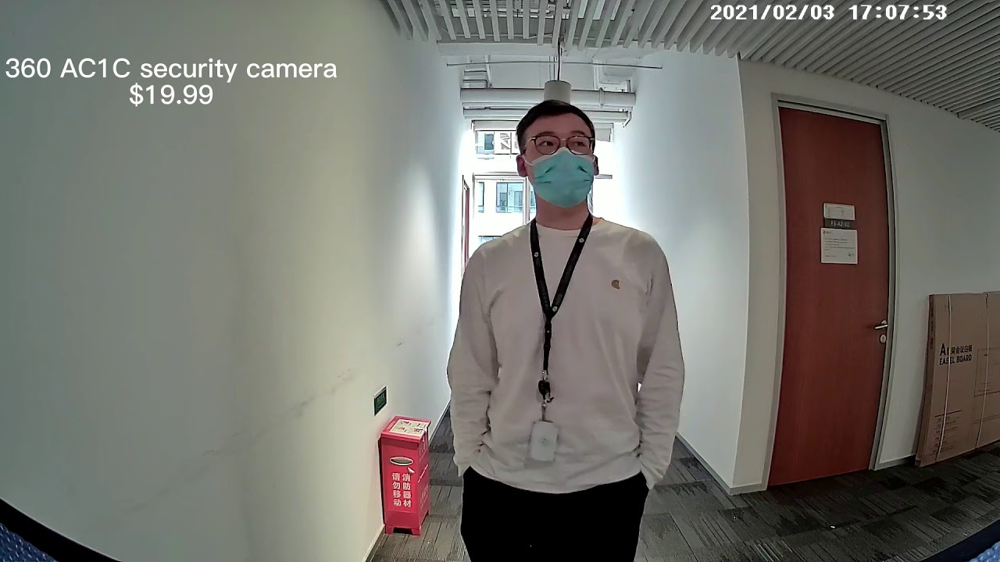
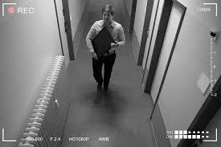
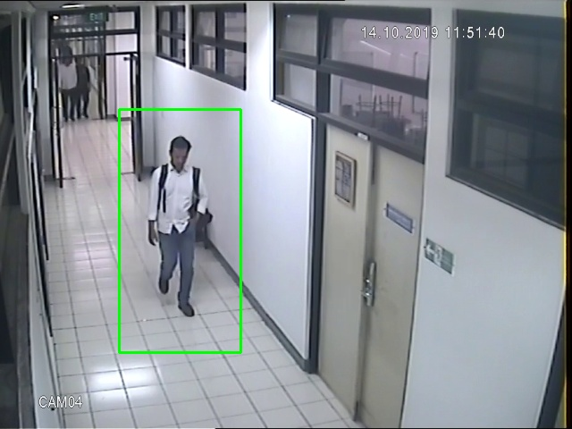
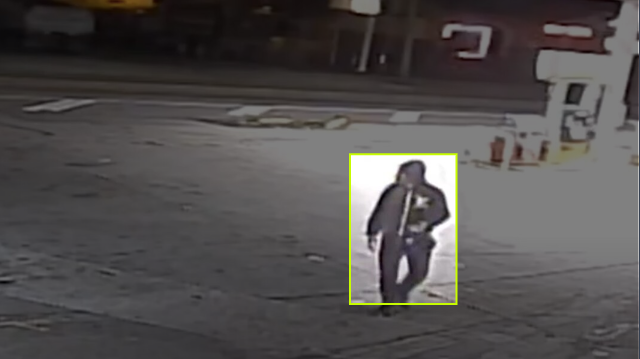

<h1 align="center"><strong> Sistema de seguridad automático</strong></h1>

## Descripción del problema

Una empresa que se dedica a rentar bodegas como las que aparecen en las [imágenes](#imágenes-de-bodegas) quiere **mejorar la eficiencia** de su sistema de seguridad. 

Dicho sistema de seguridad consiste en tener dos guardias de seguridad encargados de **revisar** la entrada y salida de personas, **vigilar la transimisión de video** de las cámaras de seguridad instaladas en todo el establecimiento y **ejecutar protocolos de seguridad** cuando detecten personas no autorizadas o personas ejecutando acciones sospechosas dentro del establecimiento.

La empresa quiere lograr mejorar la **eficacia** de su sistema de seguridad sin eliminar completamente la **corroboración humana** de los eventos o sucesos, y al mismo tiempo quiere **reducir la probabilidad** de que su personal facilite las condiciones para que suceda algún evento.

### Imágenes de bodegas

| Interiores | Exteriores |
| --- | --- |
|  |  |
|  |  |
|  |   |

## Análisis del problema

Dada la descripción general del problema, se pueden definir dos puntos clave para el diseño de la solución al problema:

1. Se quiere **mejorar la capacidad** de los guardias para **detectar eventos** a través de la transmisión de video de las cámaras de seguridad
2. Se quiere encontrar una forma de **registrar eventos** e información importante de estos cuando los guardias **no los reporten** y no ejecuten los protocolos de seguridad

## Propuesta de solución

Una opción para abordar el problema es integrar al sistema de vigilancia un [modelo de detección de objetos]() entrenado para detectar **personas** de todo tipo en diferentes **ángulos de cámara** en [imágenes](#imágenes-de-cámaras-de-seguridad) de **resolución media o baja** (resolución de cámaras de vigilancia) con vista **diurna y nocturna**. 

La idea sería que la transmisión de video que vigilan los guardias de seguridad también incluya los [recuadros generados](#imágenes-con-recuadros) por el modelo de detección, así facilitando el trabajo de detectar oportunamete eventos o sucesos. También, la idea seria que los eventos o sucesos **potenciales** que el modelo de detecte se **registraran** con la información pertinente, como las horas de inicio y fin del suceso y el fragmento de video correspondiente, así facilitándole la **investigación de sucesos sospechosos** a la administración y **disuadiendo** a los guardias de facilitar las condiciones para que suceda un evento.

### Imágenes de cámaras de seguridad

| Diurnas | Nocturnas |
| ------- | --------- |
|  |  |

### Imágenes con recuadros

| Interiores | Exteriores |
| ---------- | ---------- |
|  |  |

## Implementación de prototipo de la solución

Para hacer el prototipo de la solución se utilizó el modelo **YOLOv8 nano**, un modelo **rápido**, **ligero** y con un **buen desempeño**. Se utilizará la [implementación de ultralytics](https://github.com/ultralytics/ultralytics) para entrenar / personalizar el modelo y poder hacer inferencias, es decir, dibujar los recuadros alrededor de las personas.

Puedes seguir el proceso de cómo se logra esto con el siguiente [notebook de Jupyter](./Sistema_seguridad_automatico.ipynb), o puedes:

También puedes ver las demos de este modelo en acción en los gifs y video de la carpeta [demos](./demos).

## Enlaces útiles

[Datos](https://universe.roboflow.com/project-d4kos/human-cctv) utilizados para entrenar el modelo.

[Crear cuenta de Roboflow y obtener clave / key](https://www.youtube.com/watch?v=76E6esnez8E) para poder descargar datos desde esa plataforma (video en inglés).